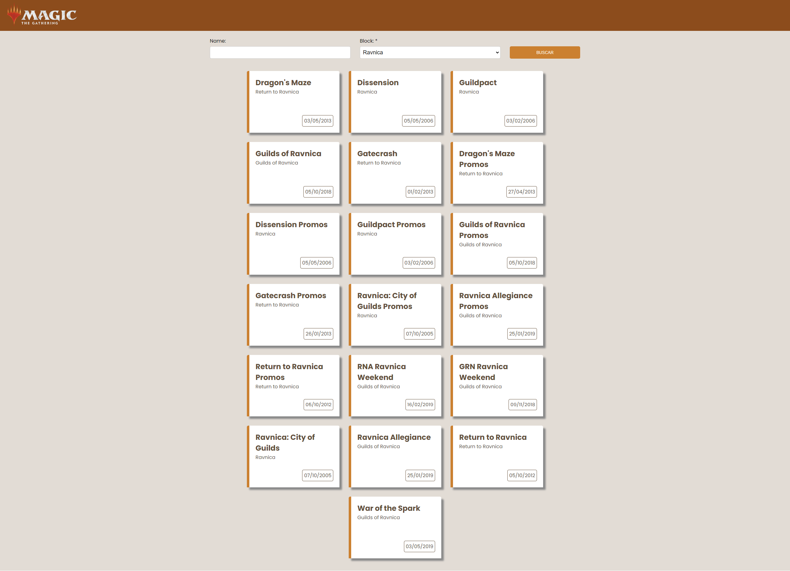

# Cardmanager

Este repositório tem como objetivo realizar um desafio proposto por uma empresa

Este projeto foi gerado com [Angular CLI](https://github.com/angular/angular-cli) versão 17.3.7

### Servidor local

Execute `ng serve` para servidor local. Navegue até `http://localhost:4200/`. A aplicação irá recarregar automaticamente se você modificar qualquer "source files".

### Scaffolding

Execute `ng generate component component-name` para gerar um novo componente. Você também pode usar `ng generate directive|pipe|service|class|guard|interface|enum|module`.

### Build

Execute `ng build` para realizar o build do projeto. Os artefatos do build serão armazenados no diretório `dist/`.

### Testes unitários

Execute `ng test` para rodar os testes unitários via [Karma](https://karma-runner.github.io).

### Resultados

https://cardmanager.vercel.app/

